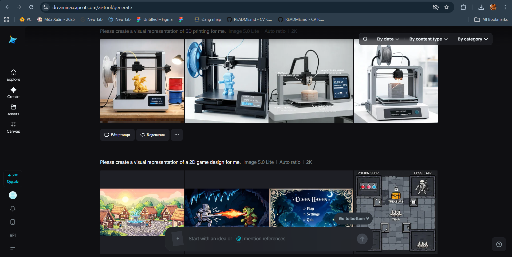

# Nguyễn Minh Cảnh
# CV — Portfolio Website
# Link video hướng dẫn thuyết minh: 
# Link dự án GitHub: https://github.com/nmcanh2808-glitch/CV
# Link trang web sản phẩm: 
# Danh sách công cụ AI: 
Em đã sử dụng trong bài: Chat GPT tạo prompt, Dreamina AI tạo hình ảnh, Figma AI tối ưu hóa UI/UX trang web.
# Ý tưởng tổng thể: 
  Em lấy 3 màu chủ đạo ở brightness mode là 3 màu mà em yêu thích, dựa trên một thảo nguyên xanh ngát là nơi thích hợp để một chú capybara thư giản, còn về phần Dark Mode em dựa theo 3 màu chủ đạo được lấy cảm hứng từ bức tranh "Bầu trời đầy sao" của họa sĩ Van Gogh, đây là một trong các tác phẩm em vô cùng yêu thích của họa sĩ Van Gogh. Để tạo ra một bầu trời êm ái dễ nhìn khi nhà tuyển dụng đọc vào ban đêm. Về các hình ảnh có trong phần Projects, như em đã trình bày trước đó. Nó được tạo ra bằng công cụ Dreamina AI.
# Giai đoạn 1: Lên ý tưởng.
  Ý tưởng ban đầu: Là một website porfolio thông thường, nhưng em lại muốn nó mang theo màu sắc và sở thích của em. Đó là Capybara(Chuột lang nước), chắc không ai mà không biết tới sự dễ thương và tài ngoại giao của giống loài chuột nước này. Em rất yêu thích các chú chuột lang nước vì vẻ mặt vô tri và lạc quan tới mắc cười. Và em rất thích các tác phẩm của họa sĩ Van Gogh (các tác phẩm điển hình của ông là: tám bức tranh hoa hướng dương, bầu trời đầy sao,...). Đó là lý do vì sao em lại muốn thực hiện hóa hai sở thích ấy vào trong một website do mình tự tạo. 
# Giai đoạn 2: Thực hiện tạo website 
  kêu chatgpt viết một bộ prompt như sau: bạn là một chuyên gia về UI/UX, hãy tạo cho tôi một portfolio chuyên nghiệp bao gồm Html + csss. Brightness mode đựa vào 3 màu chủ đạo này#F8DED3 , #FDC5B8 , #DEA5AE. Dark mode dựa vào 3 màu chủ đạo này #183282 , #6C9EB3 , #FCE997, có nút thay đổi theme ở đầu trang. Tagline: “Thiết kế trải nghiệm đơn giản, tỏa sáng khí chất riêng.”. About Me: Nguyễn Minh Cảnh, là một sinh viên tại trường GDU, hiện đang học năm 2 của nghành CNNT - Đồ Họa Kỹ Thuật Số, số điện thoại 09874634528 và ngày sinh (28.08.06). Tôi đang tập trung vào một dự án thiết kế UI/UX và game. Skill: Design (Figma, Photoshop, AI), sáng tạo nội dung. Dự án: Thiết kế Bookmark, in 3D, tại phần này tôi muốn bạn tạo ra album ảnh để trưng bày sản phẩm hay dự án. Hobbies: đá banh và đi xem phim, chơi game, nấu ăn. Contact Me: email (nguyencanh0392751543), số điện thoại 09874634528, thêm khung để nhập email và số điện thoại vào phần contact, để tôi có thể nhận và liên hệ với họ. Thêm hiệu ứng hover và chuyển động như trang web https://jomor-design-2019.webflow.io/. Hãy tạo cho tôi một bộ prompt để argent có thể thiết kế ra website như vậy. Và có được bộ prompt này:

Create a professional and modern UI/UX portfolio website using HTML, CSS, and JavaScript only.

⚠️ IMPORTANT:
The website must feel like a premium Behance/Webflow portfolio, not a generic resume website.

Focus heavily on:

* Visual hierarchy
* Motion design
* Elegant spacing
* Smooth interactions
* Artistic UI/UX presentation

━━━━━━━━━━━━━━━━━━━
🎨 COLOR SYSTEM
━━━━━━━━━━━━━━━━━━━

LIGHT MODE COLORS:
Use these as the main brightness mode palette:

* #F8DED3 → Main background
* #FDC5B8 → Secondary cards / hover surfaces
* #DEA5AE → Accent color / buttons / highlights

The light mode should feel:

* Soft
* Elegant
* Feminine-modern
* Warm and artistic

━━━━━━━━━━━━━━━━━━━
🌙 DARK MODE COLORS
━━━━━━━━━━━━━━━━━━━

DARK MODE PALETTE:

* #183282 → Main dark background
* #6C9EB3 → Secondary surfaces / cards
* #FCE997 → Accent color / highlights

The dark mode should feel:

* Premium
* Cinematic
* Artistic
* Smooth and modern

⚠️ IMPORTANT:
Do NOT use pure black.

━━━━━━━━━━━━━━━━━━━
🌙 THEME TOGGLE
━━━━━━━━━━━━━━━━━━━

Add a theme toggle button at the top-right corner.

Requirements:

* Smooth animated transition
* Animate:

  * Background colors
  * Text colors
  * Shadows
  * Borders
  * Hover states

Use:

* localStorage to save theme state
* Sun/moon animated icon
* Soft hover glow

━━━━━━━━━━━━━━━━━━━
🖋 TYPOGRAPHY
━━━━━━━━━━━━━━━━━━━

Use:

* Alberto Regular Việt hóa for headings
* Clean readable font for body text

Typography style:

* Large elegant hero title
* Minimal section headings
* Spacious line-height
* Premium UI typography hierarchy

━━━━━━━━━━━━━━━━━━━
🧩 HERO SECTION
━━━━━━━━━━━━━━━━━━━

Display:

Name:
Nguyễn Minh Cảnh

Tagline:
“Thiết kế trải nghiệm đơn giản, tỏa sáng khí chất riêng.”

Role:
UI/UX Designer Student • Digital Graphics

Additional info badges:

* 📞 09874634528
* 🎂 28.08.06

Hero layout:

* Split layout
* Large modern title
* Rounded profile image card
* Soft shadow
* Smooth fade-in animation

Add CTA buttons:

* View Projects
* Hire Me

━━━━━━━━━━━━━━━━━━━
📖 ABOUT ME SECTION
━━━━━━━━━━━━━━━━━━━

Content:

“Là một sinh viên tại trường GDU, hiện đang học năm 2 của ngành CNNT - Đồ Họa Kỹ Thuật Số.
Tôi đang tập trung vào một dự án thiết kế UI/UX và game.”

Highlight keywords:

* GDU
* UI/UX
* Game Design
* Digital Graphics

Style:

* Rounded card layout
* Spacious UI
* Soft background shapes
* Elegant typography

━━━━━━━━━━━━━━━━━━━
🧠 SKILLS SECTION
━━━━━━━━━━━━━━━━━━━

Title:
“Skills”

Display skill cards/icons for:

* Figma
* Photoshop
* Illustrator
* Content Creation

Design:

* Rounded icon cards
* Hover glow
* Floating hover animation
* Soft shadow

━━━━━━━━━━━━━━━━━━━
🚀 PROJECT GALLERY SECTION
━━━━━━━━━━━━━━━━━━━

Title:
“Projects”

Projects:

1. Thiết kế Bookmark
2. In 3D

Create a premium image gallery system.

Requirements:

* Masonry or responsive grid layout
* Rounded image cards
* Hover zoom animation
* Overlay showing:

  * Project title
  * Category
  * Short description

When clicking a project:

* Open fullscreen modal
* Show image album/gallery slider
* Previous/Next navigation
* Background blur effect

Inside project detail:

* Project description
* Design process
* Tools used
* Multiple showcase images

Gallery style should feel:

* Behance-inspired
* Artistic
* Modern
* Interactive

━━━━━━━━━━━━━━━━━━━
❤️ HOBBIES SECTION
━━━━━━━━━━━━━━━━━━━

Display hobbies as rounded modern tags/cards:

* ⚽ Đá banh
* 🎬 Xem phim
* 🎮 Chơi game
* 🍳 Nấu ăn

Style:

* Fun but elegant
* Hover interaction
* Soft scaling animation

━━━━━━━━━━━━━━━━━━━
📬 CONTACT SECTION
━━━━━━━━━━━━━━━━━━━

Title:
“Contact Me”

Subtitle:
“Let’s create something meaningful together.”

Create a premium contact form including:

Fields:

1. Full Name
2. Email Address
3. Phone Number
4. Message

Add:

* Rounded input fields
* Focus glow effect
* Soft shadows
* Animated placeholders

Contact Info Card:

* Email: nguyencanh0392751543
* Phone: 09874634528

Add:

* Send Message button
* Hover lift animation
* Smooth interaction feedback

━━━━━━━━━━━━━━━━━━━
✨ HOVER EFFECTS & MOTION
━━━━━━━━━━━━━━━━━━━

Inspired by:
https://jomor-design-2019.webflow.io/

Add:

* Smooth section reveal animations
* Image hover zoom
* Floating cards
* Cursor interaction feeling
* Animated underline navigation
* Smooth button scaling
* Soft hover glow
* Elegant shadow movement

Motion style:

* Minimal
* Premium
* Fluid
* Modern

Avoid:

* Heavy parallax
* Overly flashy animations

━━━━━━━━━━━━━━━━━━━
🖼 BACKGROUND STYLE
━━━━━━━━━━━━━━━━━━━

Create abstract artistic background elements:

* Organic blob shapes
* Soft gradients
* Blur overlays
* Layered UI depth

Optional:

* Floating animated shapes
* Subtle grain texture

━━━━━━━━━━━━━━━━━━━
⚙️ TECHNICAL REQUIREMENTS
━━━━━━━━━━━━━━━━━━━

* HTML + CSS + JavaScript only
* No frameworks
* Responsive design
* Semantic HTML
* Organized CSS structure
* CSS variables for theme system
* Optimized animations
* Clean code comments

⚠️ FINAL GOAL:
The portfolio must feel like a high-end creative UI/UX designer website with artistic personality, smooth motion, elegant typography, and interactive project galleries.

# Giai đoạn 3: Tối ưu UI/UX.
Em dùng tới figma AI để tối ưu lại phần thiết kế UI/UX, theo các tiêu chí như sau:
+ UI/UX gọn gàng, tối giản.
+ Hoạt ảnh hiện đại.
+ Hiệu ứng ánh sáng dịu nhẹ.
+ đáp ứng cho mọi thiết bị (PC, Phone).
+ Thêm hoạt ảnh Thêm hoạt ảnh di chuột mượt mà.
+ Cải thiện thứ bậc kiểu chữ.
+ Sử dụng bố cục thẻ hiện đại.
+ Thêm hiệu ứng glassmorphism.
+ Cải thiện khoảng cách và căn chỉnh, cải thiện sự hài hòa màu sắc.
+ Thêm thanh điều hướng hiện đại,thêm hiệu ứng chuyển tiếp hoạt ảnh giữa các phần.
+ Thay đổi màu chủ đạo của Brightness Mode thành 3 màu này #6FAF5F, #3F6B3A, #D9C46B.

# Giai đoạn 4: Thay đổi bổ sung bộ prompt.
  Sau khi dung Figma AI để tối ưu cho UI/UX, em dùng chat để viết prompt bổ sung như sau
  tôi muốn bạn viết lại bộ prompt, thay đổi chế độ sáng dựa trên ba màu cơ bản: #6FAF5F, #3F6B3A, #D9C46B. Chế độ tối dựa trên ba màu cơ bản: #183282, #6C9EB3, #FCE997. Thêm hình minh họa và hình ảnh chuột lang nước chibi với các biểu cảm khác nhau (vui vẻ, buồn ngủ, uể oải). và giữ lại các thông tin cá nhân, skills, projects, contact. Thêm Work Experience với các thông tin này (2024: Tốt nghiệp THPT và nhập học trường đại học GGDU, 2025: Tôi xin vào làm trong một studio sản xuất hoạt hình và làm bộ phận chỉnh sửa hậu kỳ, 2026: Dự định bản thân trong tương lai được làm việc trong một cty phim hoạt hình Việt Nam). Tôi muốn bạn phân tích bức ảnh UI/UX trên mà tôi đã dùng FIgma AI để tối ưu lại để viết prompt để argent có thể thiết kế ra website như vậy.
  Bộ Prompt: 
Create a premium modern portfolio website inspired by the UI/UX layout shown in the attached reference image.

⚠️ IMPORTANT:
Do NOT copy the exact layout.
Use it only as inspiration for:

* spacing
* visual hierarchy
* soft UI cards
* floating navigation
* modern portfolio composition
* rounded minimalist sections

The website should feel:

* Calm
* Creative
* Soft
* Interactive
* Artistic
* Modern UI/UX portfolio style

━━━━━━━━━━━━━━━━━━━
🎨 LIGHT MODE COLOR SYSTEM
━━━━━━━━━━━━━━━━━━━

Use these 3 primary colors for LIGHT MODE:

* #6FAF5F → Primary green
* #3F6B3A → Deep green
* #D9C46B → Warm yellow accent

Light mode feeling:

* Nature inspired
* Calm
* Cozy
* Friendly
* Organic modern UI

Apply colors like:

* Main background → soft off-white mixed with light green tint
* Buttons → green/yellow accents
* Hover states → darker green
* Decorative shapes → pastel green/yellow gradients

━━━━━━━━━━━━━━━━━━━
🌙 DARK MODE COLOR SYSTEM
━━━━━━━━━━━━━━━━━━━

Use these 3 primary colors for DARK MODE:

* #183282 → Main dark background
* #6C9EB3 → Secondary surfaces/cards
* #FCE997 → Accent/highlight color

Dark mode feeling:

* Cinematic
* Calm
* Premium
* Artistic

⚠️ IMPORTANT:
Do NOT use pure black.

Add smooth animated transition between themes:

* background
* text
* borders
* shadows
* hover effects

Use localStorage to save theme.

━━━━━━━━━━━━━━━━━━━
🖋 TYPOGRAPHY
━━━━━━━━━━━━━━━━━━━

Use:
“Alberto Regular Việt hóa”

Requirements:

* Large modern headings
* Spacious typography
* Rounded friendly appearance
* Fully support Vietnamese characters

Body text:

* Clean sans-serif font
* Soft readability
* Modern UI hierarchy

━━━━━━━━━━━━━━━━━━━
🧩 NAVIGATION BAR
━━━━━━━━━━━━━━━━━━━

Create a floating navigation bar similar to the reference UI.

Style:

* Rounded container
* Semi-transparent surface
* Soft shadow
* Sticky top navigation
* Minimal links

Navigation items:

* Home
* About
* Skills
* Projects
* Experience
* Contact

Add:

* Animated hover underline
* Smooth hover movement
* Theme toggle button on top-right

━━━━━━━━━━━━━━━━━━━
🖼 HERO SECTION
━━━━━━━━━━━━━━━━━━━

Split layout:
LEFT:

* Large illustration area
* Add chibi capybara illustrations
* Different expressions:

  * Happy
  * Sleepy
  * Tired
* Soft floating animation
* Cute artistic style

RIGHT:
Display:

Name:
Nguyễn Minh Cảnh

Tagline:
“Thiết kế trải nghiệm đơn giản, tỏa sáng khí chất riêng.”

Role:
UI/UX Designer Student • Digital Graphics

Info badges:

* 📞 09874634528
* 🎂 28.08.06

Add:

* View Projects button
* Hire Me button

Hero style:

* Spacious
* Elegant
* Soft UI
* Floating cards
* Fade-in animations

━━━━━━━━━━━━━━━━━━━
📖 ABOUT ME SECTION
━━━━━━━━━━━━━━━━━━━

Layout inspired by the reference image:

* Left large card
* Right feature cards

Content:

“Nguyễn Minh Cảnh, là một sinh viên tại trường GDU, hiện đang học năm 2 của ngành CNNT - Đồ Họa Kỹ Thuật Số.
Tôi đang tập trung vào một dự án thiết kế UI/UX và game.”

Inside the left card:

* Add a large capybara image/banner
* Rounded image corners
* Soft shadows

Right side:
Create feature cards:

* Creative Design
* UI/UX Thinking
* Performance
* Storytelling

Each card:

* Rounded
* Soft icon circle
* Hover animation
* Minimal modern style

━━━━━━━━━━━━━━━━━━━
🧠 SKILLS SECTION
━━━━━━━━━━━━━━━━━━━

Skills:

* Figma
* Photoshop
* Illustrator
* Premiere Pro
* Content Creation

Display as:

* Rounded icon cards
* Floating hover effect
* Glow animation
* Soft shadow

Style:

* Similar to modern UI portfolio dashboards

━━━━━━━━━━━━━━━━━━━
🚀 PROJECT SECTION
━━━━━━━━━━━━━━━━━━━

Projects:

1. Thiết kế Bookmark
2. In 3D
3. Game 2D
4. Website Interface Design

Use images from:
`/images/`

Create:

* Responsive project gallery
* Rounded image cards
* Hover zoom
* Overlay reveal animation

When clicking:

* Open fullscreen modal
* Image album/gallery
* Previous/next slider
* Background blur

Inside project detail:

* Project description
* Design process
* Tools used
* Showcase images

Gallery style:

* Behance inspired
* Artistic
* Spacious
* Premium UI

━━━━━━━━━━━━━━━━━━━
💼 WORK EXPERIENCE SECTION
━━━━━━━━━━━━━━━━━━━

Create a modern timeline section.

Timeline items:

2024

* Tốt nghiệp THPT và nhập học trường đại học GGDU

2025

* Tôi xin vào làm trong một studio sản xuất hoạt hình và làm bộ phận chỉnh sửa hậu kỳ

2026

* Dự định bản thân trong tương lai được làm việc trong một công ty phim hoạt hình Việt Nam

Design:

* Vertical timeline
* Rounded timeline cards
* Soft animations
* Modern minimal UI

━━━━━━━━━━━━━━━━━━━
❤️ HOBBIES SECTION
━━━━━━━━━━━━━━━━━━━

Display hobbies as floating rounded tags/cards:

* ⚽ Đá banh
* 🎬 Xem phim
* 🎮 Chơi game
* 🍳 Nấu ăn

Add:

* Hover scaling
* Soft floating motion
* Cute capybara icons nearby

━━━━━━━━━━━━━━━━━━━
📬 CONTACT SECTION
━━━━━━━━━━━━━━━━━━━

Title:
“Contact Me”

Create a premium contact form.

Fields:

* Full Name
* Email
* Phone Number
* Message

Add:

* Rounded inputs
* Focus glow
* Soft shadow
* Animated placeholders

Contact card:

* Email:
  [nguyencanh0392751543@gmail.com](mailto:nguyencanh0392751543@gmail.com)
* Phone:
  09874634528

Add:

* Send Message button
* Hover lift animation

━━━━━━━━━━━━━━━━━━━
✨ HOVER EFFECTS & MOTION
━━━━━━━━━━━━━━━━━━━

Inspired by:

* Webflow premium portfolios
* Behance featured projects
* Modern editorial UI

Add:

* Floating cards
* Soft hover lift
* Smooth image zoom
* Fade-in sections
* Cursor interaction feeling
* Animated underline navigation
* Smooth shadow transitions

Motion should feel:

* Soft
* Elegant
* Calm
* Premium

━━━━━━━━━━━━━━━━━━━
🖼 BACKGROUND STYLE
━━━━━━━━━━━━━━━━━━━

Create:

* Organic blob shapes
* Soft gradients
* Nature-inspired decorative curves
* Floating background elements
* Minimal abstract illustrations

Add:

* Chibi capybara illustrations throughout sections
* Tiny animated decorative elements

━━━━━━━━━━━━━━━━━━━
⚙️ TECHNICAL REQUIREMENTS
━━━━━━━━━━━━━━━━━━━

* HTML + CSS + JavaScript
* No frameworks
* Responsive design
* Semantic HTML
* CSS variables for theme system
* Optimized animations
* Smooth transitions
* Organized clean code

⚠️ FINAL GOAL:
The final website should feel like a premium artistic UI/UX portfolio with cozy capybara personality, modern motion design, smooth interaction, and a professional creative identity.
Enhance the existing portfolio website by adding advanced image gallery interactions, horizontal image presentation layouts, floating bubble-image decorations, and a custom footer inspired by the provided UI references.

  Tiếp đến em nhờ chat GPT thay đổi theo các chức năng hình ảnh, hiệu ứng mà em đã dùng Figma tối ưu: 
  Tôi muốn bạn phân tích các chức năng thêm hình ảnh, trình bày ảnh theo dạng ngang và các hiệu ứng bong bóng có chức năng chứa hình ảnh ở nền trang web. Từ đó hãy giúp tôi viết prompt bổ sung các chức năng ấy. Hãy viết prompt để argent có thể thiết kế ra website như vậy.

  Bộ Prompt: 
Enhance the existing portfolio website by adding advanced image gallery interactions, horizontal image presentation layouts, floating bubble-image decorations, and a custom footer inspired by the provided UI references.

⚠️ IMPORTANT:
The new features must match the current soft UI/UX aesthetic:

* calm
* organic
* artistic
* premium
* interactive

The website should feel like:

* a modern Behance portfolio
* a creative designer showcase
* an experimental Webflow UI

━━━━━━━━━━━━━━━━━━━
🖼 ADVANCED PROJECT IMAGE SYSTEM
━━━━━━━━━━━━━━━━━━━

Upgrade the project gallery section into a premium interactive image showcase.

Requirements:

* Horizontal image presentation
* Multi-image preview strips
* Image slider/gallery system
* Hover interactions
* Fullscreen modal preview

━━━━━━━━━━━━━━━━━━━
📸 HORIZONTAL IMAGE LAYOUT
━━━━━━━━━━━━━━━━━━━

Inside each project card:

Display images in:

* horizontal collage layout
* side-by-side image strips
* asymmetrical grid compositions

Example:

* 3 horizontal preview images per card
* First image larger
* Remaining images smaller

Layout style:

* modern editorial gallery
* Behance showcase style
* soft rounded corners

Use:

* object-fit: cover
* consistent aspect ratios
* responsive image scaling

━━━━━━━━━━━━━━━━━━━
✨ PROJECT CARD INTERACTIONS
━━━━━━━━━━━━━━━━━━━

Each project card should include:

* Hover image zoom
* Overlay fade effect
* Floating shadow movement
* Smooth border glow
* Hover lift animation

Overlay content:

* Project title
* Category
* Image count badge

Example badge:
“3 images”

Badge style:

* rounded capsule
* semi-transparent glassmorphism
* soft shadow

━━━━━━━━━━━━━━━━━━━
🪟 FULLSCREEN IMAGE MODAL
━━━━━━━━━━━━━━━━━━━

When clicking a project:

Open a fullscreen modal gallery.

Features:

* Large centered image
* Previous / next navigation
* Smooth image transitions
* Dark blurred background
* Rounded modal corners

Add:

* Image counter
* Progress indicator
* Animated slider dots

Navigation buttons:

* Circular buttons
* Soft shadow
* Hover scaling
* Minimal UI

Modal animation:

* fade-in
* scale transition
* smooth blur appearance

━━━━━━━━━━━━━━━━━━━
🫧 FLOATING BUBBLE IMAGE SYSTEM
━━━━━━━━━━━━━━━━━━━

Create decorative floating bubble elements throughout the background.

⚠️ IMPORTANT:
The bubbles should contain images inside them.

Use:

* capybara images
* project thumbnails
* tiny illustration previews

━━━━━━━━━━━━━━━━━━━
🫧 BUBBLE DESIGN STYLE
━━━━━━━━━━━━━━━━━━━

Bubble appearance:

* soft transparent circles
* blurred edges
* glow effect
* floating movement
* layered depth

Inside bubbles:

* cropped circular images
* soft opacity
* subtle blur

Bubble sizes:

* small
* medium
* large

Randomly distribute bubbles around:

* hero section
* project section
* background corners
* page edges

━━━━━━━━━━━━━━━━━━━
✨ BUBBLE ANIMATIONS
━━━━━━━━━━━━━━━━━━━

Bubble movement should feel:

* slow
* organic
* dreamy
* lightweight

Add:

* floating animation
* gentle drifting
* scale pulsing
* opacity shifting

Use:

* CSS keyframes
* subtle transform animations

Avoid:

* fast motion
* distracting movement

━━━━━━━━━━━━━━━━━━━
🌿 BACKGROUND ATMOSPHERE
━━━━━━━━━━━━━━━━━━━

Enhance the background using:

* soft green glow gradients
* blurred organic shapes
* layered transparent circles
* nature-inspired lighting

Create depth using:

* z-index layering
* backdrop blur
* glow opacity

The page should feel:

* alive
* breathable
* artistic
* cozy

━━━━━━━━━━━━━━━━━━━
🖼 IMAGE SOURCES
━━━━━━━━━━━━━━━━━━━

Load all project images and bubble images from:
`/images/`

Examples:

* /images/bookmark-1.jpg
* /images/game2d-1.jpg
* /images/capy-happy.png
* /images/capy-sleepy.png

Use:

* lazy loading
* optimized rendering
* responsive image handling

━━━━━━━━━━━━━━━━━━━
🦫 CAPYBARA VISUAL SYSTEM
━━━━━━━━━━━━━━━━━━━

Add chibi capybara illustrations across the website.

Expressions:

* happy
* sleepy
* tired

Use them:

* inside floating bubbles
* hero section decorations
* hover illustrations
* empty space fillers

Style:

* cute
* soft
* hand-drawn feeling
* warm personality

━━━━━━━━━━━━━━━━━━━
📍 FOOTER SECTION
━━━━━━━━━━━━━━━━━━━

At the bottom of the page, add a premium footer line:

“© By Cappy_Boiz 2026. Trường Đại Học GDU”

Footer style:

* centered text
* soft opacity
* minimal typography
* subtle separator line

Add:

* fade-in animation
* hover glow on text
* smooth spacing

Dark mode:

* cream/light text
* subtle glow
* maintain readability

━━━━━━━━━━━━━━━━━━━
✨ UI/UX STYLE REQUIREMENTS
━━━━━━━━━━━━━━━━━━━

The final interaction system should feel:

* premium
* modern
* soft
* cinematic
* creative

Inspired by:

* Webflow interactive portfolios
* Behance featured galleries
* Apple soft UI
* Editorial showcase websites

━━━━━━━━━━━━━━━━━━━
⚙️ TECHNICAL REQUIREMENTS
━━━━━━━━━━━━━━━━━━━

* HTML + CSS + JavaScript
* Responsive design
* CSS variables
* Optimized animations
* Semantic HTML
* Smooth transitions
* Organized code structure

Use:

* CSS Grid
* Flexbox
* Keyframe animations
* Backdrop-filter blur
* Transform transitions

⚠️ FINAL GOAL:
The website should feel like a living artistic portfolio with floating visual storytelling, interactive image galleries, soft motion design, and a unique capybara-themed personality.

  Yêu cầu chat GPT thay đổi:
  Ở mục UI/UX Designer Student ngay hình Avatar, tôi muốn xóa hết các hình ảnh nhỏ ở đó. Tăng thêm số lượng hiệu ứng bong bóng nhỏ mờ trôi nổi và thêm các hình Capy1.jpg, Capy2.jpg, Capy3.jpg, Capy4.jpg, Capy5.jpg, Capy6.jpg theo kích thước phù hợp với hiệu ứng bong bóng.

  Bộ Prompt:
Update the Hero section and floating bubble system of the portfolio website.

⚠️ IMPORTANT:
Maintain the current premium soft UI style and cinematic portfolio aesthetic.

━━━━━━━━━━━━━━━━━━━
🖼 HERO AVATAR CLEANUP
━━━━━━━━━━━━━━━━━━━

In the Hero section:

Locate the main avatar/profile image area beside:
“UI/UX Designer Student”

Remove ALL small floating preview images currently attached around the avatar image.

⚠️ IMPORTANT:
Keep ONLY:

* the main large avatar image
* the rounded image container
* the glow/shadow effects

The Hero section should feel:

* cleaner
* more minimal
* more premium
* less visually crowded

━━━━━━━━━━━━━━━━━━━
🫧 FLOATING BUBBLE SYSTEM ENHANCEMENT
━━━━━━━━━━━━━━━━━━━

Increase the number of floating transparent bubbles across the entire website background.

Bubble style:

* soft transparent circles
* blurred edges
* layered opacity
* glow lighting
* cinematic floating effect

The page should feel:

* dreamy
* alive
* breathable
* artistic

━━━━━━━━━━━━━━━━━━━
🦫 CAPYBARA IMAGE BUBBLES
━━━━━━━━━━━━━━━━━━━

Add these images into the floating bubble system:

* Capy1.jpg
* Capy2.jpg
* Capy3.jpg
* Capy4.jpg
* Capy5.jpg
* Capy6.jpg

Image location:
`/images/`

━━━━━━━━━━━━━━━━━━━
🫧 IMAGE BUBBLE DESIGN
━━━━━━━━━━━━━━━━━━━

Display the Capy images:

* inside circular floating bubbles
* softly cropped
* partially transparent
* with blur and glow effects

Bubble image styling:

* object-fit: cover
* circular masks
* subtle overlay gradients
* soft border glow

━━━━━━━━━━━━━━━━━━━
📏 BUBBLE SIZE VARIATION
━━━━━━━━━━━━━━━━━━━

Create multiple bubble sizes:

Small:

* tiny decorative bubbles
* subtle background movement

Medium:

* decorative focus elements

Large:

* occasional hero-area floating bubbles

Use randomized positioning around:

* hero section
* page corners
* project section
* empty spaces
* background layers

━━━━━━━━━━━━━━━━━━━
✨ FLOATING ANIMATIONS
━━━━━━━━━━━━━━━━━━━

Bubble movement should feel:

* slow
* smooth
* natural
* organic

Add:

* drifting animation
* floating up/down movement
* soft opacity pulsing
* slight scaling animation

Use:

* CSS keyframes
* transform translateY
* opacity animation
* blur transitions

Avoid:

* fast movement
* distracting motion
* overlapping important text

━━━━━━━━━━━━━━━━━━━
🌿 BACKGROUND ATMOSPHERE IMPROVEMENT
━━━━━━━━━━━━━━━━━━━

Enhance the atmospheric background using:

* soft green glow blobs
* transparent layered circles
* blurred radial gradients
* smooth depth layering

Create:

* depth
* cinematic softness
* premium modern UI feeling

━━━━━━━━━━━━━━━━━━━
🎨 VISUAL STYLE
━━━━━━━━━━━━━━━━━━━

The final effect should feel inspired by:

* modern Webflow portfolios
* soft Apple UI
* dreamy editorial websites
* artistic designer showcases

Overall mood:

* cozy
* playful
* premium
* calm
* creative

━━━━━━━━━━━━━━━━━━━
⚙️ TECHNICAL REQUIREMENTS
━━━━━━━━━━━━━━━━━━━

* Use optimized image rendering
* Responsive bubble scaling
* CSS animations only preferred
* Prevent FPS/performance issues
* Use z-index layering carefully

Optional:

* slight mouse-parallax movement
* blur depth simulation

⚠️ FINAL GOAL:
The background should feel like a living soft-motion artistic environment filled with floating capybara memories and dreamy visual atmosphere.

Yêu Cầu chat GPT thay đổi:
tôi muốn các hiệu ứng hình ảnh bong bóng mờ trôi nổi gọn lại, phân bố đồng đều ở 2 bên trái phải của trang web và không được xuất hiện ở giữa các thông tin của trang web. 

Bộ Prompt: Refine and reorganize the floating bubble image system across the portfolio website.

⚠️ IMPORTANT:
The floating bubbles currently feel too scattered and visually distracting.

Rebuild the bubble layout so it becomes:

* cleaner
* more organized
* balanced
* professional
* less intrusive to the content

━━━━━━━━━━━━━━━━━━━
🫧 BUBBLE POSITIONING UPDATE
━━━━━━━━━━━━━━━━━━━

Move ALL floating bubble effects away from the center content areas.

⚠️ IMPORTANT:
Bubbles must NOT appear:

* on top of text
* inside content cards
* overlapping buttons
* blocking project information
* interfering with readability

Instead:
Place bubbles ONLY around:

* left edges of the page
* right edges of the page
* outer background margins
* corners of sections

━━━━━━━━━━━━━━━━━━━
📐 BALANCED BUBBLE DISTRIBUTION
━━━━━━━━━━━━━━━━━━━

Distribute bubbles evenly across:

* left side background
* right side background

Create visual balance:

* symmetrical spacing
* clean composition
* organized layering

Bubble placement should feel:

* intentional
* decorative
* minimal
* premium

Avoid:

* random clutter
* center overlap
* excessive density

━━━━━━━━━━━━━━━━━━━
🫧 BUBBLE SIZE CONTROL
━━━━━━━━━━━━━━━━━━━

Reduce the overall size and intensity of the bubbles.

Use:

* mostly small bubbles
* a few medium bubbles
* very limited large bubbles

Opacity:

* lower transparency
* softer glow
* lighter blur

━━━━━━━━━━━━━━━━━━━
✨ BUBBLE VISUAL STYLE
━━━━━━━━━━━━━━━━━━━

Keep the current:

* capybara image bubbles
* blur effects
* floating motion

But make them:

* more subtle
* softer
* cleaner
* less dominant visually

Style:

* elegant ambient decoration
* background atmosphere only

━━━━━━━━━━━━━━━━━━━
🌿 SAFE CONTENT ZONES
━━━━━━━━━━━━━━━━━━━

Create invisible “safe zones” in the center of each section.

No bubbles should appear inside:

* Hero text area
* About Me text
* Skills cards
* Project cards
* Contact form
* Footer text

Only allow bubbles in:

* background margins
* side spacing
* outer layout edges

━━━━━━━━━━━━━━━━━━━
🎨 ATMOSPHERE GOAL
━━━━━━━━━━━━━━━━━━━

The final bubble system should feel:

* cinematic
* breathable
* cozy
* premium
* naturally integrated

Inspired by:

* Apple soft UI backgrounds
* Webflow premium portfolios
* editorial ambient design

━━━━━━━━━━━━━━━━━━━
⚙️ TECHNICAL REQUIREMENTS
━━━━━━━━━━━━━━━━━━━

* Use absolute positioning carefully
* Responsive layout support
* Maintain performance
* Prevent overlap with interactive UI

Optional:

* create layered depth with z-index
* use slow randomized floating animation
* adaptive bubble visibility on mobile

⚠️ FINAL GOAL:
The bubbles should become elegant atmospheric decorations that frame the website from the sides instead of interrupting the content in the center.

  Yêu cầu chat GPT: Viết prompt bổ sung thêm phần project (game 2D, website interface design). Bổ sung Skill (Premier). Đổi font chữ hiện tại thành Font việt hóa Alberto Regular: Hãy tạo cho tôi một bộ prompt để argent có thể thiết kế ra website như vậy.
  Bộ Prompt:
Enhance the existing portfolio website by adding new projects, updating the skills section, and changing the typography system.

━━━━━━━━━━━━━━━━━━━
🖋 TYPOGRAPHY UPDATE
━━━━━━━━━━━━━━━━━━━

Replace the current typography with:

“Alberto Regular Việt hóa”

Requirements:

* Apply Alberto Regular to:

  * Hero titles
  * Section headings
  * Navigation
  * Buttons
  * Project titles

Typography feeling:

* Elegant
* Artistic
* Premium
* Creative UI/UX portfolio style

Requirements:

* Support full Vietnamese characters
* Smooth font rendering
* Maintain readability
* Large spacious typography hierarchy

Body text:

* Can use a secondary clean sans-serif font if needed
* Keep balance between artistic and readable UI

━━━━━━━━━━━━━━━━━━━
🚀 PROJECT SECTION UPDATE
━━━━━━━━━━━━━━━━━━━

Add 2 new projects into the existing project gallery:

3. Game 2D
4. Website Interface Design

━━━━━━━━━━━━━━━━━━━
🎮 PROJECT: GAME 2D
━━━━━━━━━━━━━━━━━━━

Create a modern project showcase card for:
“Game 2D”

Project card should include:

* Thumbnail image
* Hover overlay
* Category label:
  “Game Design”

Inside project detail/modal:

* Multiple screenshots/gallery images
* Gameplay showcase images
* Short project description
* Design process
* Tools used

Visual style:

* Interactive
* Creative
* Slightly playful
* Modern game UI aesthetic

Hover effects:

* Smooth zoom
* Glow border
* Animated overlay reveal

━━━━━━━━━━━━━━━━━━━
💻 PROJECT: WEBSITE INTERFACE DESIGN
━━━━━━━━━━━━━━━━━━━

Create another showcase card for:
“Website Interface Design”

Category:
“UI/UX Design”

Inside project detail/modal:

* UI mockups
* Wireframes
* Website preview images
* Responsive showcase layouts

Include:

* Design process
* Color system
* Typography showcase
* UI components

Visual style:

* Minimal
* Behance-inspired
* Modern product design feeling

━━━━━━━━━━━━━━━━━━━
🖼 PROJECT GALLERY IMPROVEMENTS
━━━━━━━━━━━━━━━━━━━

Update the gallery system:

* Responsive masonry/grid layout
* Smooth hover transitions
* Floating card interaction
* Rounded corners
* Premium shadow system

Modal interactions:

* Smooth popup animation
* Background blur
* Animated image slider
* Next/Prev buttons

━━━━━━━━━━━━━━━━━━━
🧠 SKILLS SECTION UPDATE
━━━━━━━━━━━━━━━━━━━

Add:

* Premiere Pro

Updated Skills:

* Figma
* Photoshop
* Illustrator
* Premiere Pro
* Content Creation

Display style:

* Modern icon cards
* Hover glow animation
* Floating motion effect
* Rounded UI components

━━━━━━━━━━━━━━━━━━━
✨ MOTION & INTERACTION
━━━━━━━━━━━━━━━━━━━

Apply premium motion design:

* Smooth hover scaling
* Elegant shadow movement
* Animated section reveal
* Soft transitions
* Premium interaction feedback

Inspired by:

* Behance portfolios
* Webflow creative websites
* Modern UI/UX designer portfolios

━━━━━━━━━━━━━━━━━━━
⚙️ TECHNICAL REQUIREMENTS
━━━━━━━━━━━━━━━━━━━

* HTML + CSS + JavaScript
* Responsive layout
* Semantic HTML
* Optimized animations
* Smooth transitions
* Clean organized structure

⚠️ IMPORTANT:
The portfolio should feel like a modern creative designer showcase with premium UI/UX presentation and smooth interaction design.

  Yêu cầu chat bổ sung thêm tính năng để thay đổi hình ảnh hiển thị của phần project thành ảnh Design mà tôi đã drop vào thư mục images của github. Hãy tạo cho tôi một bộ prompt để argent có thể thiết kế ra website như vậy.
  Bộ Prompt:
Update the existing portfolio website project gallery to use the design images that were uploaded into the GitHub "images" folder.

⚠️ IMPORTANT:
Replace all placeholder project thumbnails with the real uploaded images from the GitHub images directory.

━━━━━━━━━━━━━━━━━━━
🖼 PROJECT IMAGE SYSTEM
━━━━━━━━━━━━━━━━━━━

Use images from:
`/images/`

Apply uploaded images to these project sections:

1. Thiết kế Bookmark
2. In 3D
3. Game 2D
4. Website Interface Design

━━━━━━━━━━━━━━━━━━━
📂 IMAGE HANDLING
━━━━━━━━━━━━━━━━━━━

Requirements:

* Automatically load images from the images folder
* Use proper image paths
* Keep responsive image scaling
* Maintain image quality
* Prevent image distortion

Example:

* /images/bookmark-1.jpg
* /images/3d-1.jpg
* /images/game2d-1.jpg
* /images/ui-design-1.jpg

━━━━━━━━━━━━━━━━━━━
🎨 PROJECT CARD UPDATE
━━━━━━━━━━━━━━━━━━━

Each project card should:

* Display the uploaded design image as thumbnail
* Use cover-fit image scaling
* Rounded corners
* Smooth hover zoom effect
* Overlay animation

Overlay should show:

* Project title
* Category
* Short description

━━━━━━━━━━━━━━━━━━━
✨ HOVER & ANIMATION
━━━━━━━━━━━━━━━━━━━

Hover effects inspired by premium Behance/Webflow portfolios:

* Slight image zoom
* Smooth overlay fade
* Floating card movement
* Shadow elevation
* Cursor interaction feeling

Transition style:

* Smooth
* Premium
* Elegant
* Modern

━━━━━━━━━━━━━━━━━━━
🖼 MODAL / GALLERY VIEW
━━━━━━━━━━━━━━━━━━━

When clicking a project image:

* Open fullscreen modal
* Display all related uploaded images
* Create image slider/gallery
* Add next/previous navigation
* Smooth popup animation
* Background blur effect

Gallery layout:

* Clean
* Spacious
* Modern creative portfolio style

━━━━━━━━━━━━━━━━━━━
📱 RESPONSIVE IMAGE DESIGN
━━━━━━━━━━━━━━━━━━━

Requirements:

* Responsive grid layout
* Proper image cropping
* Consistent card ratio
* Mobile-friendly gallery
* Adaptive image scaling

━━━━━━━━━━━━━━━━━━━
⚙️ TECHNICAL REQUIREMENTS
━━━━━━━━━━━━━━━━━━━

* HTML + CSS + JavaScript
* Use semantic image structure
* Lazy loading optional
* Optimized rendering
* Smooth animation performance

Use:

* object-fit: cover
* CSS grid or masonry layout
* Transition animations

⚠️ IMPORTANT:
The uploaded images should feel like premium showcase assets inside a professional UI/UX portfolio, not like a simple image dump.

# Giai đoạn 5: Tạo ảnh bằng Dreamina AI.
  Em đã sử dụng công cụ Dreamina AI tạo ảnh và thay thế chúng. Ngoài ra, em yêu cầu VS Code thêm hiệu ứng rơi trên nền trang web để tăng sự hút cho CV.
. 
# Giai đoạn 6: Hoàn thiện sản phẩm.
  Bằng các công cụ AI trợ giúp để thực hiện hóa Website theo ý tưởng của mình. Và đây là kết quả sản phẩm của em.
 

 
 
 